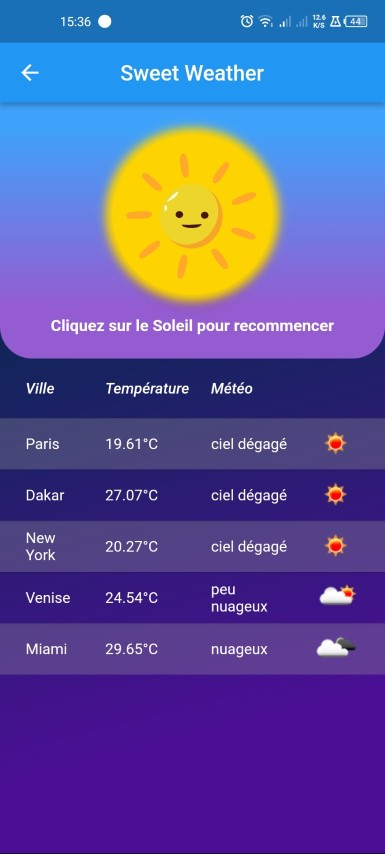

# Mon Projet Flutter : SWEET WEATHER

Ce projet est une application Flutter qui affiche la météo de 5 villes différentes en utilisant l'API OpenWeatherMap. L'application se présente avec 2 pages ,
Le premier qui affiche un bouton avec une animation qui nous permet d'aller sur une seconde page qui contient une jauge de progression en pourcentage en demi-cercle 
avec une animation pour faire patienter l'utilisateur et affiche les résultats sous forme de tableau.

## Captures d'écran





## Fonctionnalités

- Écran d'accueil avec une jauge de progression en pourcentage en demi-cercle
- La jauge se remplit à 100% en 60 secondes (1 pourcent chaque 600 millisecondes)
- Appels API météo toutes les 10 secondes pour 5 villes (Paris, Dakar, New York, Venise, Miami) en utilisant Retrofit
- Messages d'attente qui changent toutes les 6 secondes
- Affichage des résultats sous forme de tableau avec le nom de la ville, la température, la couverture nuageuse et une icône provenant du site.
(gestion des erreurs au cas ou les informations sont indisponibles)
- Bouton "Recommencer" en forme de soleil pour relancer la requête
- Possibilité de revenir à l'écran d'accueil en appuyant sur le bouton "back"

## Installation

1. Clonez ce dépôt :
```
git clone https://github.com/Mamadoulaminedabo/Sweet-weather.git
```

2. Accédez au répertoire du projet :
```
cd votre-projet-flutter
```

3. Installez les dépendances :
```
flutter pub get
```

4. Lancez l'application sur un émulateur ou un appareil physique :
```
flutter run
```

## Configuration

Pour utiliser l'API OpenWeatherMap, vous devez obtenir une clé API. Inscrivez-vous sur [https://openweathermap.org/](https://openweathermap.org/) et récupérez votre clé API. Ensuite, ajoutez-la dans le fichier `lib/controllers/Loading_PageController.dart` :


```dart
String apiKey = "votre clé API";
```
##
Ce projet m'a permit de découvrir des outils tels que getx ou retrofit qui facilite vraiment la vie.
J'ai aussi découvert le monde des animations dans flutter. Je me suis lancer comme defit de ne pas utiliser d'image mais de quand meme faire un beau design.
Flutter >>> Kotlin

## Licence
Ce projet est en openSource vous pouvez vous en inspirer pour votre application météo :)
